# Library Management System

A full-scale, self-hostable library management system built with modern technologies. Organizations can fork and customize this system to their needs.

## Features

### Core Features
- **Multi-role Authentication**: Admin, Librarian, Member, Guest roles with JWT authentication
- **Book Management**: CRUD operations, ISBN lookup, barcode generation, cover images
- **Catalog System**: Advanced search, filters, sorting, pagination
- **Circulation System**: Check-out/check-in, renewals, reservations, overdue tracking
- **Fine Management**: Automated fine calculation, payment tracking, waiver requests
- **Notification System**: Email notifications for due dates, availability, fines

### Technical Features
- TypeScript throughout (frontend and backend)
- PostgreSQL with Sequelize ORM
- React with TanStack Query for state management
- Tailwind CSS for styling
- Docker support for easy deployment
- Rate limiting and security headers

## Screenshots

| | |
|---|---|
| 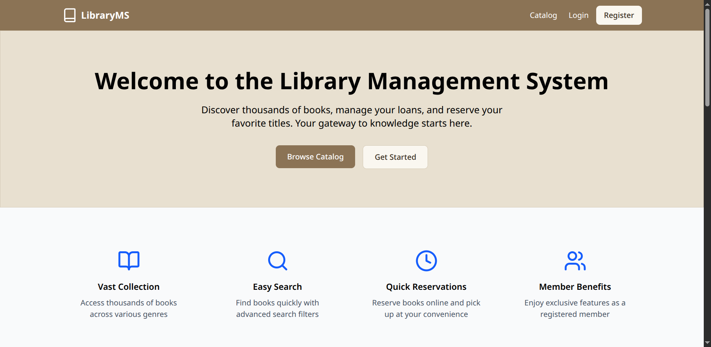 | 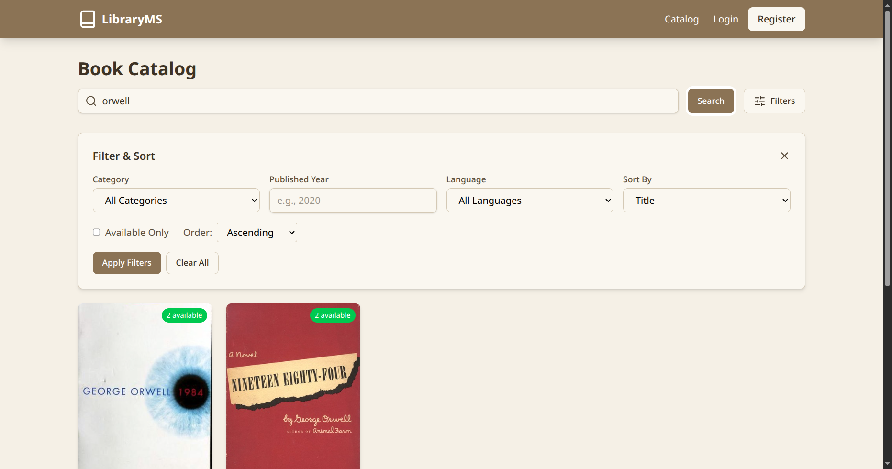 |
| **Landing page** | **Catalog with category, language and sort filters** |
| 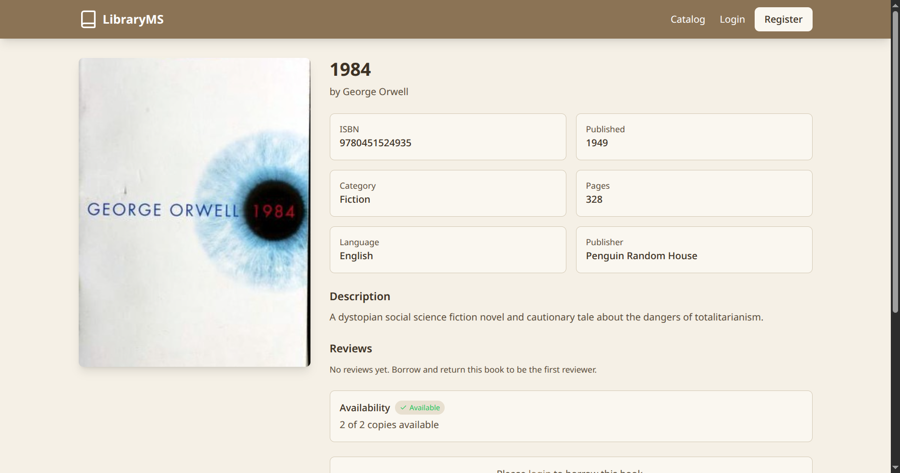 | 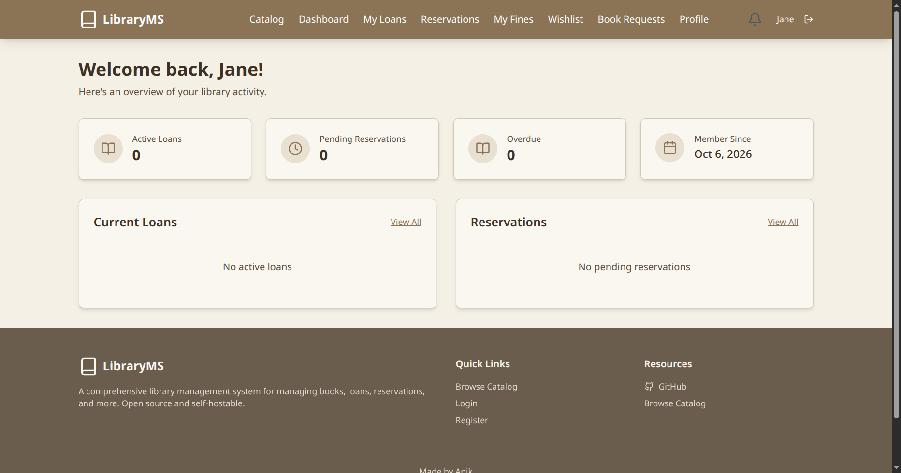 |
| **Book detail with reviews and availability** | **Member dashboard** |
| 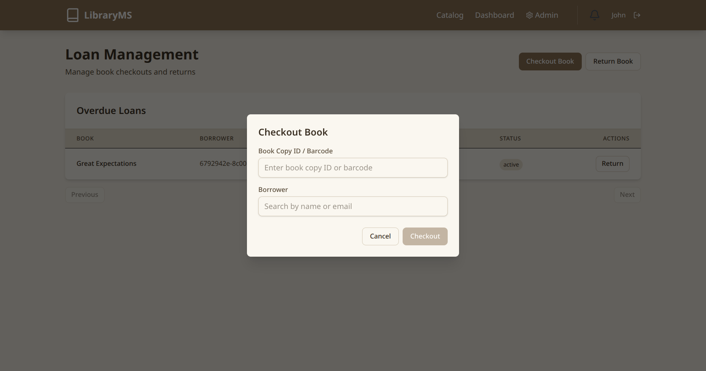 | 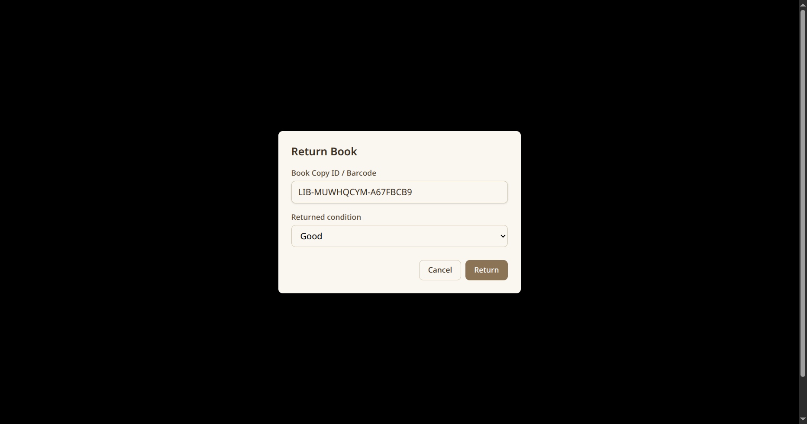 |
| **Desk checkout: scan a barcode, search the borrower** | **Return: capture the item condition** |
| 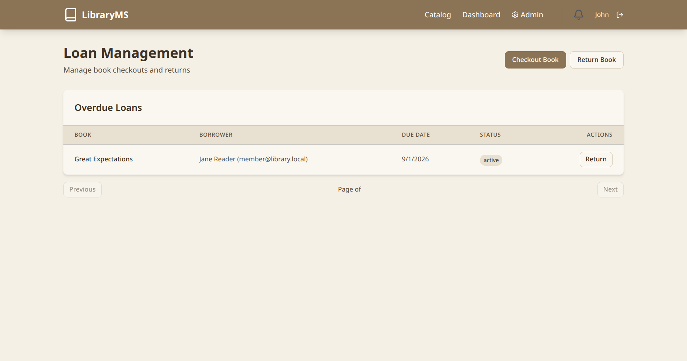 | 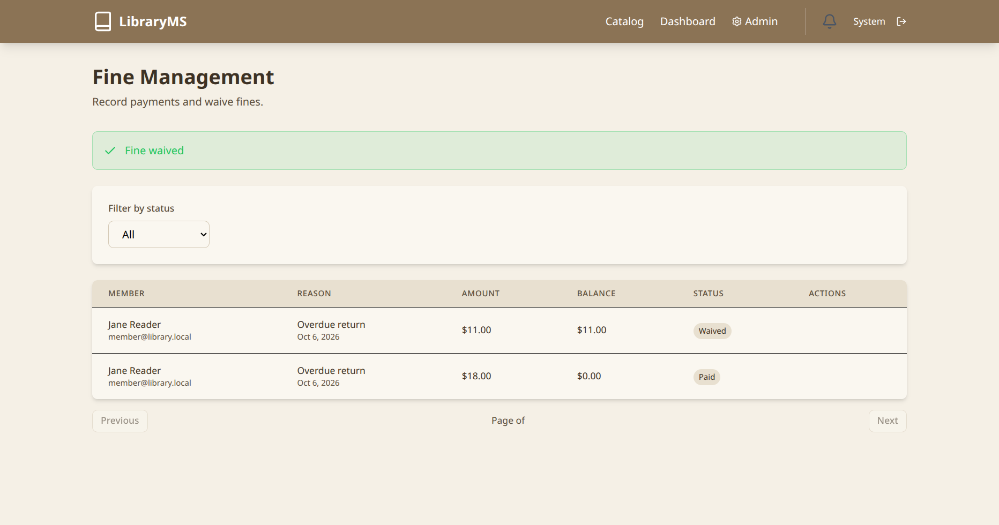 |
| **Overdue loans with borrower and fine context** | **Fine payment and waiver management** |
| 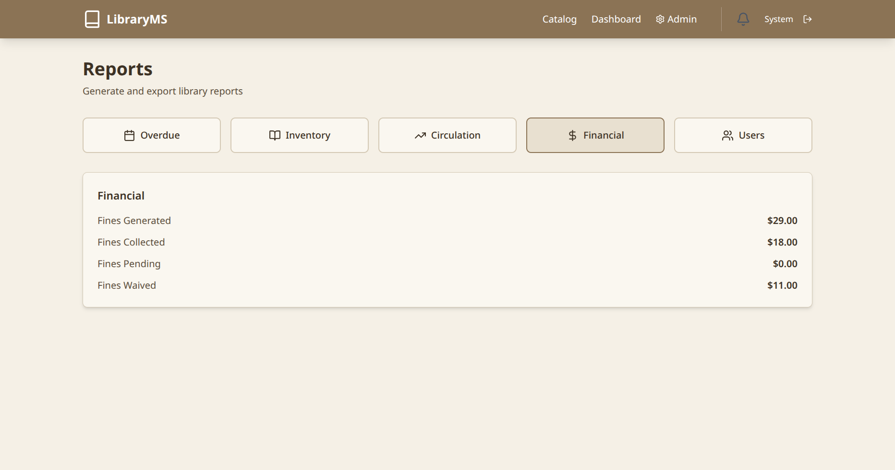 | 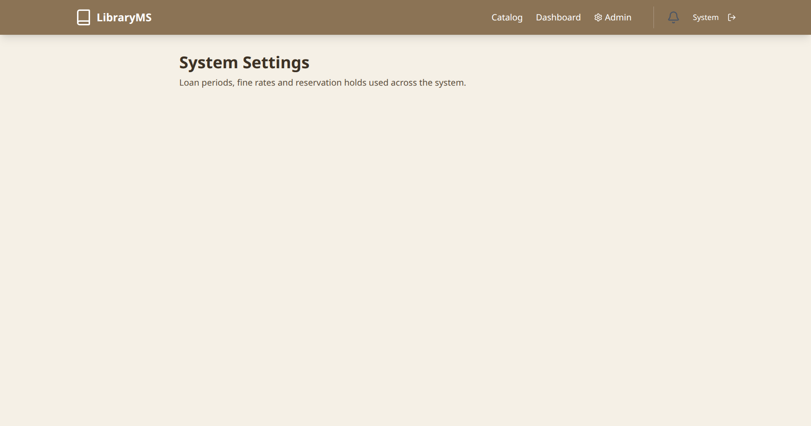 |
| **Reports with CSV export** | **Policy settings (loan period, fine rate, holds)** |
| 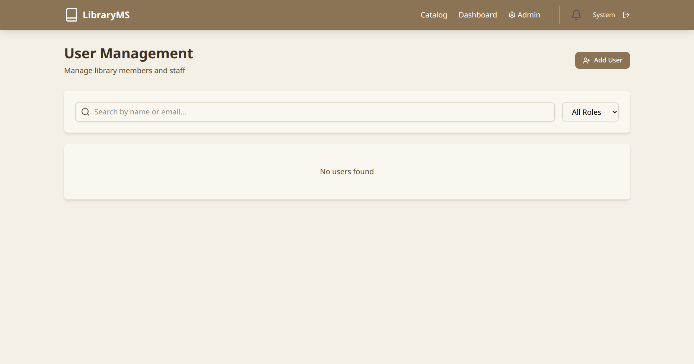 | 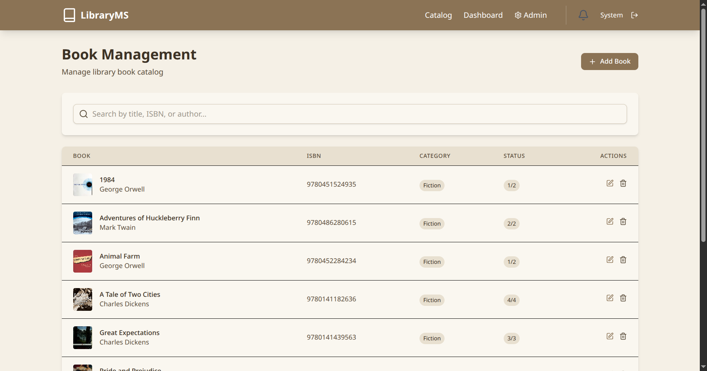 |
| **User management** | **Book management with Open Library import** |

## Quick Start

### Prerequisites
- Node.js 18+
- PostgreSQL 14+
- npm or yarn

### Development Setup

1. **Clone the repository**
   ```bash
   git clone <repository-url>
   cd Library_Management_System
   ```

2. **Set up environment variables**
   ```bash
   cp .env.example server/.env
   # Edit server/.env with your database credentials and secrets
   ```

3. **Install dependencies**
   ```bash
   cd server && npm install
   cd ../client && npm install
   ```

4. **Set up the database**
   ```bash
   # Create database
   psql -U postgres -c "CREATE DATABASE library_db;"

   # Apply versioned schema migrations
   cd server && npm run db:migrate

   # Seed system settings (loan period, fine rate, ...)
   npm run db:seed
   ```

5. **Start development servers**
   ```bash
   # Terminal 1 - Backend
   cd server && npm run dev

   # Terminal 2 - Frontend
   cd client && npm run dev
   ```

6. **Access the application**
   - Frontend: http://localhost:5173
   - API: http://localhost:3001/api/v1

## Docker Deployment

### Using Docker Compose

1. **Set environment variables**
   ```bash
   export DB_PASSWORD="your_secure_password"
   export JWT_SECRET="your_jwt_secret_min_64_chars"
   export JWT_REFRESH_SECRET="your_refresh_secret_min_64_chars"
   ```

2. **Build and run**
   ```bash
   docker-compose up -d --build
   ```

3. **Access the application**
   - Frontend: http://localhost
   - API: http://localhost:3001/api/v1

## Project Structure

```
Library_Management_System/
├── client/                 # React frontend
│   ├── src/
│   │   ├── components/     # Reusable UI components
│   │   ├── hooks/          # Custom React hooks
│   │   ├── pages/          # Page components
│   │   ├── services/       # API services
│   │   ├── store/          # Zustand state management
│   │   ├── types/          # TypeScript types
│   │   └── utils/          # Utility functions
│   └── package.json
├── server/                 # Express backend
│   ├── src/
│   │   ├── config/         # Configuration files
│   │   ├── controllers/    # Route controllers
│   │   ├── middleware/     # Express middleware
│   │   ├── models/         # Sequelize models
│   │   ├── routes/         # API routes
│   │   ├── services/       # Business logic
│   │   ├── types/          # TypeScript types
│   │   ├── utils/          # Utility functions
│   │   └── validators/     # Input validation
│   └── package.json
├── __docs__/               # Documentation
├── logs/                   # Application logs
├── docker-compose.yml      # Docker orchestration
└── README.md
```

## API Endpoints

A complete, current endpoint reference lives in
[`__docs__/api/endpoints.md`](__docs__/api/endpoints.md). Highlights:

### Authentication
- `POST /api/v1/auth/register` - Register new member
- `POST /api/v1/auth/login` - Login (refresh token in HttpOnly cookie)
- `POST /api/v1/auth/refresh-token` - Rotate the session
- `POST /api/v1/auth/logout` - Revoke the session

### Catalog & Circulation
- `GET /api/v1/books` - Search/filter/sort the catalog
- `POST /api/v1/books/:id/reviews` - Review a returned title
- `POST /api/v1/loans/checkout` / `checkin` - Barcode or copy ID
- `POST /api/v1/reservations` - Join the waitlist

### Fines, inventory and admin
- `GET /api/v1/fines/my`, `POST /api/v1/fines/:id/pay`, `.../waive`
- `GET /api/v1/book-copies?bookId=`, `PATCH /api/v1/book-copies/:id`
- `GET /api/v1/libraries`, `POST /api/v1/admin/users`
- `GET /api/v1/reports/dashboard`, `GET/PUT /api/v1/settings`

## Configuration

### Environment Variables

See `.env.example` for all available configuration options:

| Variable | Description | Required |
|----------|-------------|----------|
| `DB_HOST` | PostgreSQL host | Yes |
| `DB_PASSWORD` | Database password | Yes |
| `JWT_SECRET` | JWT signing secret (64+ chars) | Yes |
| `JWT_REFRESH_SECRET` | Refresh token secret | Yes |
| `SMTP_HOST` | Email server host | No |
| `CORS_ORIGIN` | Allowed frontend origin | Yes |

## Security

- JWT authentication with refresh tokens
- Password hashing with bcrypt (12 rounds)
- Rate limiting on all endpoints
- CORS protection
- Helmet security headers
- Input validation with express-validator
- Parameterized SQL queries via Sequelize

## Contributing

1. Fork the repository
2. Create a feature branch (`git checkout -b feature/amazing-feature`)
3. Commit changes (`git commit -m 'feat: add amazing feature'`)
4. Push to branch (`git push origin feature/amazing-feature`)
5. Open a Pull Request

## License

MIT License - see LICENSE file for details.
